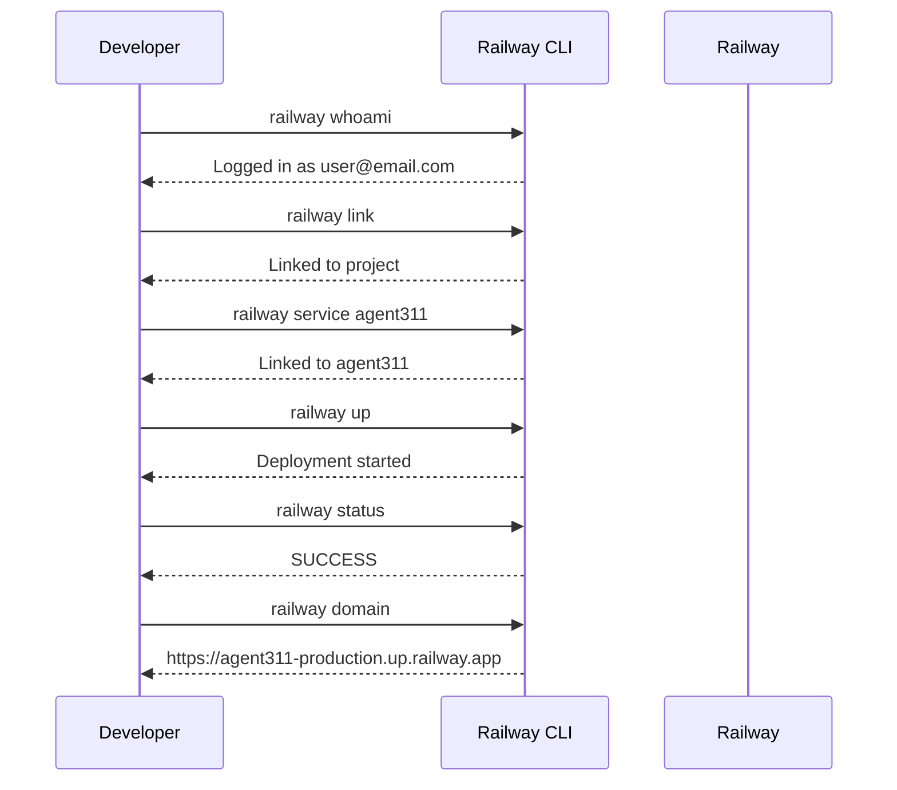

# Railway Deployment Guide

A comprehensive guide to deploying services on Railway using the Railway CLI. Covers Python/FastAPI, React/JavaScript, and Docker deployments.

**Requirements:**
- **Railway CLI**: Install via `brew install railway` or `npm install -g @railway/cli`
- **Authentication**: Run `railway login` or set `RAILWAY_TOKEN` environment variable
  - Get your token: `railway login --browserless` (opens browser, copy token from URL)
  - Or from dashboard: [railway.app/account/tokens](https://railway.app/account/tokens)

---

## Table of Contents

- [Overview](#overview)
- [Architecture](#architecture)
- [Prerequisites](#prerequisites)
- [Railway CLI Reference](#railway-cli-reference)
- [Section A: Python/FastAPI (Railpack)](#section-a-pythonfastapi-railpack)
- [Section B: React/Vite Frontend (Railpack)](#section-b-reactvite-frontend-railpack)
- [Section B2: Next.js Frontend (Railpack)](#section-b2-nextjs-frontend-railpack)
- [Section C: Docker Image Service](#section-c-docker-image-service)
- [Multi-Service Architecture](#multi-service-architecture)
- [Common Errors and Fixes](#common-errors-and-fixes)
- [Appendix: Railway GraphQL API Recipes](#appendix-railway-graphql-api-recipes)
- [Appendix: Creating a Claude Code Skill](#appendix-creating-a-claude-code-skill)

---

## Overview

This guide covers three deployment types, all driven by the Railway CLI:

| Type | Builder | Use Case |
|------|---------|----------|
| **A. Python/FastAPI** | Railpack | Backend APIs with uv package manager |
| **B. React/Vite** | Railpack | Vite-based frontends served as static files |
| **B2. Next.js** | Railpack | Next.js apps in a monorepo subdirectory |
| **C. Docker** | Dockerfile | Custom builds, system dependencies, multi-stage |

Each section includes config files, CLI commands, mermaid diagrams, and battle-tested gotchas from real deployments.

---

## Architecture

```mermaid
graph TB
    subgraph Railway Project
        BE[Backend Service<br>Python/FastAPI<br>Railpack]
        FE[Frontend Service<br>React/Vite<br>Railpack]
        AUI[agentui Service<br>Next.js<br>Railpack]
        DK[Docker Service<br>Custom Image<br>Dockerfile]
    end

    subgraph Domains
        BED[backend.up.railway.app]
        FED[frontend.up.railway.app]
        AUID[agentui.up.railway.app]
        DKD[docker-svc.up.railway.app]
    end

    BE --> BED
    FE --> FED
    AUI --> AUID
    DK --> DKD

    FE -->|fetch /api/chat| BE
    AUI -->|fetch /api/chat| BE
    DK -->|railway.internal| BE

    GH[GitHub Repo] -->|auto-deploy on push| Railway Project
    CLI[Railway CLI] -->|railway up| Railway Project
```

### Project Structure (Monorepo)

```
repo-root/
├── agent311/                  # Python backend package
│   ├── agent311/
│   │   └── main.py            # FastAPI app entry point
│   ├── pyproject.toml
│   ├── uv.lock
│   ├── railpack.json
│   └── railway.json
├── frontend/                  # React/Vite frontend (old)
│   ├── src/
│   │   ├── App.jsx
│   │   ├── App.css
│   │   └── main.jsx
│   ├── index.html
│   ├── package.json
│   ├── vite.config.js
│   ├── railpack.json
│   └── .env.production
├── agentui/                   # Next.js frontend
│   ├── app/
│   │   ├── layout.tsx
│   │   └── page.tsx
│   ├── components/
│   ├── package.json           # Must have engines.node >= 20
│   ├── railpack.json
│   └── railway.json
└── CLAUDE.md
```

---

## Prerequisites

| Requirement | How to Get It | Verify |
|-------------|--------------|--------|
| Railway account | [railway.com](https://railway.com) | — |
| Railway CLI | `brew install railway` | `railway --version` |
| Railway auth | `railway login` | `railway whoami` |
| uv (Python) | `curl -LsSf https://astral.sh/uv/install.sh \| sh` | `uv --version` |
| Node.js (Frontend) | [nodejs.org](https://nodejs.org) | `node --version` |

---

## Railway CLI Reference

### Installation

**Using Homebrew (macOS/Linux):**
```bash
brew install railway
```

**Using npm:**
```bash
npm install -g @railway/cli
```

**Verify installation:**
```bash
railway --version
```

### Authentication

```bash
# Interactive login (opens browser)
railway login

# Browserless login (for servers/CI)
railway login --browserless

# Check authentication status
railway whoami

# Use token directly
export RAILWAY_TOKEN=your-token-here
```

### Command Reference

| Operation | Railway CLI Command | Description |
|-----------|-------------------|-------------|
| Check status | `railway whoami` | Check CLI installation and authentication |
| Create project | `railway init` | Create new project and link to directory |
| Link project | `railway link` | Link directory to existing project |
| Deploy | `railway up` | Deploy current directory to Railway |
| Generate domain | `railway domain` | Generate/manage public domain |
| View logs | `railway logs` | View service logs |
| Switch environment | `railway environment <name>` | Switch active environment |
| Link service | `railway service <name>` | Link to specific service |
| Show status | `railway status` | Show deployment status and services |
| List projects | `railway list` | List all projects |
| List variables | `railway variables` | List environment variables |
| Set variables | `railway variables set KEY=value` | Set environment variables |

### Common CLI Workflows

**Initial setup:**
```bash
# Create and link new project
railway init
# Select "Create new project" → enter name → choose environment

# Or link to existing project
railway link
# Select project from list
```

**Deploy workflow:**
```bash
# Deploy current directory
railway up

# Deploy with CI mode (stream logs and exit)
railway up --ci

# Deploy specific service
railway up --service backend
```

**Environment management:**
```bash
# List environments
railway environment

# Switch environment
railway environment production

# Create new environment
railway environment add staging
```

**Service management:**
```bash
# List services
railway status

# Link to specific service
railway service backend

# View service logs
railway logs

# View logs with filters (CLI v4.9.0+)
railway logs --lines 100
railway logs --filter "error"

# Stream live logs
railway logs --follow
```

**Domain management:**
```bash
# Generate domain for current service
railway domain

# List all domains
railway domain --list
```

**Variable management:**
```bash
# List variables
railway variables

# Set variable
railway variables set API_KEY=abc123

# Set multiple variables
railway variables set API_KEY=abc123 DEBUG=true

# Delete variable
railway variables delete API_KEY
```

**Project info:**
```bash
# Show project status
railway status

# Show deployment history
railway status --json | jq

# Open project in browser
railway open
```

**Advanced usage:**
```bash
# Link project to specific directory
cd /path/to/project
railway link

# Deploy from subdirectory
cd frontend
railway up

# Run commands with Railway env vars loaded
railway run npm start
railway run python manage.py migrate

# Shell into running service
railway shell

# View build logs for a specific deployment
railway logs --deployment <deployment-id>
```

---

## Section A: Python/FastAPI (Railpack)

Deploy a FastAPI backend using uv as the package manager and Railpack as the builder.

### Prerequisites

- `uv` installed locally (`uv --version`)
- `pyproject.toml` + `uv.lock` at service root
- `.python-version` at service root

### Config Files

#### `agent311/pyproject.toml`

```toml
[project]
name = "agent311"
version = "0.1.0"
description = ""
readme = "README.md"
requires-python = ">=3.11"
dependencies = [
    "claude-agent-sdk",
    "fastapi",
    "uvicorn",
]

[build-system]
requires = ["hatchling"]
build-backend = "hatchling.build"
```

> **Gotcha:** The build backend is `hatchling.build`, NOT `hatchling.backends` (which doesn't exist and will crash the build).

#### `agent311/railpack.json`

```json
{
  "$schema": "https://schema.railpack.com",
  "deploy": {
    "startCommand": "python -m uvicorn agent311.main:app --host 0.0.0.0 --port ${PORT:-8000}"
  }
}
```

> **Gotcha:** Use `python -m uvicorn`, not bare `uvicorn`. The venv `bin/` may not be on PATH at runtime.

> **Note:** Railpack auto-detects uv from `pyproject.toml` + `uv.lock` and installs the latest uv via mise. No version pin needed.

#### `agent311/railway.json`

```json
{
  "$schema": "https://railway.com/railway.schema.json",
  "build": {
    "builder": "RAILPACK"
  }
}
```

#### `agent311/.python-version`

```
3.12
```

#### `uv.lock`

Generate with:
```bash
uv lock
```

Commit this file. Railpack detects uv by the presence of `pyproject.toml` + `uv.lock` at the service root.

### Deployment Flow



### Step-by-Step

```bash
# 1. Verify status
railway whoami

# 2. Link to project and service
cd agent311
railway link
railway service agent311
railway environment production

# 3. Deploy
railway up

# 4. Generate public domain
railway domain

# 5. Verify deployment
railway status

# 6. Check logs if needed
railway logs --lines 50
```

### Verification

```bash
curl https://your-service-production.up.railway.app/
# {"message":"Hello, World!"}
```

Visit `/docs` for the auto-generated FastAPI Swagger UI.

### What Railpack Does Automatically

1. Detects `pyproject.toml` + `uv.lock` at service root
2. Installs the latest uv via mise
3. Sets up Python 3.12 (from `.python-version`)
4. Runs `uv sync --frozen` to install all dependencies
5. Starts the app with the command from `railpack.json`

---

## Section B: React/Vite Frontend (Railpack)

Deploy a Vite React frontend as a separate Railway service that communicates with the FastAPI backend. Railpack auto-detects Node.js from `package.json`.

### Prerequisites

- Node.js installed locally
- `package.json` in the frontend directory
- Backend already deployed with a public domain

### Config Files

#### `frontend/package.json`

```json
{
  "name": "agent311-frontend",
  "private": true,
  "version": "0.1.0",
  "type": "module",
  "scripts": {
    "dev": "vite",
    "build": "vite build",
    "preview": "vite preview"
  },
  "dependencies": {
    "@ai-sdk/react": "^3.0.79",
    "react": "^19.0.0",
    "react-dom": "^19.0.0"
  },
  "devDependencies": {
    "@vitejs/plugin-react": "^4.3.4",
    "vite": "^6.0.0"
  }
}
```

#### `frontend/vite.config.js`

```js
import { defineConfig } from "vite";
import react from "@vitejs/plugin-react";

export default defineConfig({
  plugins: [react()],
});
```

#### `frontend/railpack.json`

```json
{
  "$schema": "https://schema.railpack.com",
  "deploy": {
    "startCommand": "npx serve dist"
  }
}
```

#### `frontend/.env.production`

```
VITE_API_URL=https://<your-backend-service>.up.railway.app
```

> **Gotcha:** Vite embeds `VITE_*` variables into the JavaScript bundle at **build time**, not runtime. Railway environment variables are only available at container runtime. You MUST use `.env.production` for Vite build-time variables.

### CORS on the Backend

The FastAPI backend must allow cross-origin requests since frontend and backend are on different domains:

```python
from fastapi import FastAPI
from fastapi.middleware.cors import CORSMiddleware

app = FastAPI()

app.add_middleware(
    CORSMiddleware,
    allow_origins=["*"],
    allow_methods=["*"],
    allow_headers=["*"],
)
```

### Root Directory

The frontend lives in `frontend/`, not the repo root. Set the root directory in the Railway dashboard (Settings > Root Directory > `frontend`) or via the GraphQL API (see [Appendix](#set-root-directory)).

### Step-by-Step

```bash
# 1. Link to frontend service
cd frontend
railway link
railway service frontend
railway environment production

# 2. Set root directory in Railway dashboard, then:

# 3. Deploy
railway up

# 4. Generate domain
railway domain

# 5. Verify
railway status
curl https://frontend-production-xxxx.up.railway.app/
```

---

## Section B2: Next.js Frontend (Railpack)

Deploy a Next.js frontend (`agentui/`) as a separate Railway service in a monorepo.

For the full step-by-step walkthrough and all gotchas, see the dedicated guide: **[Deploying Next.js on Railway](railway-nextjs-setup.md)**.

### Key Differences from Vite Frontend

| Aspect | Vite Frontend (Section B) | Next.js (agentui) |
|--------|--------------------------|-------------------|
| Framework | Vite + React | Next.js 16 |
| Directory | `frontend/` | `agentui/` |
| Node.js version | 18+ works | **20+ required** |
| Serving | `npx serve dist` (static) | `next start` (SSR) |
| API URL | Build-time `VITE_*` env var | Runtime `NEXT_PUBLIC_*` env var |
| Config-as-code | Not used | `agentui/railway.json` |

### Config Files

#### `agentui/railpack.json`

```json
{
  "$schema": "https://schema.railpack.com",
  "deploy": {
    "startCommand": "npm run start"
  }
}
```

#### `agentui/railway.json`

```json
{
  "$schema": "https://railway.com/railway.schema.json",
  "build": {
    "builder": "RAILPACK"
  }
}
```

#### `agentui/package.json` (key fields)

```json
{
  "engines": {
    "node": ">=20.9.0"
  }
}
```

### Step-by-Step

```bash
# 1. Link to agentui service
cd agentui
railway link
railway service agentui
railway environment production

# 2. Set variables
railway variables set NEXT_PUBLIC_API_URL=https://your-backend.up.railway.app

# 3. Set root directory in Railway dashboard to /agentui, then:

# 4. Deploy
railway up

# 5. Generate domain
railway domain

# 6. Verify
railway status
```

### Critical Gotchas (Summary)

1. **Root directory** must be set in Railway dashboard (Settings > Root Directory > `/agentui`) — cannot be set via CLI
2. **Config-as-code path** must be set in Railway dashboard (Settings > Config-as-code > `agentui/railway.json`) — then Apply changes
3. **Dashboard changes require Apply** — Railway shows "N changes" badge but doesn't auto-apply
4. **`packageManager` field in package.json** may force a different package manager — remove it if using npm
5. **Node.js version** — add `"engines": {"node": ">=20.9.0"}` to `package.json` so Railpack installs Node.js 20+

---

## Section C: Docker Image Service

Deploy a service using a custom Dockerfile instead of Railpack.

### When to Use Docker vs Railpack

| Criteria | Railpack | Docker |
|----------|----------|--------|
| Standard Python/Node.js app | Yes | Overkill |
| Custom system packages | Limited | Yes |
| Multi-stage builds | No | Yes |
| Precise build control | No | Yes |
| Existing Dockerfile | N/A | Yes |
| Zero-config deployment | Yes | No |

### Dockerfile Examples

#### Python/FastAPI

```dockerfile
FROM python:3.12-slim

WORKDIR /app

# Install uv
RUN pip install uv

# Install dependencies
COPY pyproject.toml uv.lock ./
RUN uv sync --no-dev --frozen

# Copy application
COPY agent311/ ./agent311/

EXPOSE 8000
CMD ["python", "-m", "uvicorn", "agent311.main:app", "--host", "0.0.0.0", "--port", "8000"]
```

#### Node.js/React (Multi-Stage)

```dockerfile
# Build stage
FROM node:20-slim AS builder
WORKDIR /app
COPY package*.json ./
RUN npm ci
COPY . .
RUN npm run build

# Production stage
FROM node:20-slim
WORKDIR /app
RUN npm install -g serve
COPY --from=builder /app/dist ./dist
EXPOSE 3000
CMD ["serve", "dist", "-l", "3000"]
```

### Config: `railway.json`

```json
{
  "$schema": "https://railway.com/railway.schema.json",
  "build": {
    "builder": "DOCKERFILE"
  }
}
```

### Step-by-Step

```bash
# 1. Link to service
railway link
railway service docker-svc
railway environment production

# 2. Set builder via railway.json (above) or GraphQL API (see Appendix)

# 3. Set variables
railway variables set PORT=8000

# 4. Deploy
railway up

# 5. Generate domain
railway domain

# 6. Verify
railway status
curl https://docker-svc-production.up.railway.app/
```

### .dockerignore

Always include a `.dockerignore` to keep the build context small:

```
.git
node_modules
__pycache__
*.pyc
.env
.venv
dist
```

---

## Multi-Service Architecture

### Monorepo Layout

```
repo-root/
├── agent311/         ← Backend service (root dir: /agent311)
│   ├── agent311/
│   │   └── main.py
│   ├── pyproject.toml
│   ├── uv.lock
│   └── railpack.json
├── frontend/         ← Vite frontend service (root dir: /frontend)
│   ├── src/
│   ├── package.json
│   └── railpack.json
├── agentui/          ← Next.js frontend service (root dir: /agentui)
│   ├── app/
│   ├── package.json
│   ├── railpack.json
│   └── railway.json  ← Config-as-code for this service
```

Each Railway service in the same project can have a different **root directory**, set in the Railway dashboard:
- Backend: `/agent311` — reads `agent311/pyproject.toml`, `agent311/railpack.json`, `agent311/railway.json`
- Frontend: `/frontend` — reads `frontend/package.json`, `frontend/railpack.json`
- agentui: `/agentui` — reads `agentui/package.json`, `agentui/railpack.json`, `agentui/railway.json`

### Deploying Multiple Services

```bash
# Deploy backend
cd agent311
railway link && railway service agent311
railway up

# Deploy frontend
cd ../frontend
railway link && railway service frontend
railway up

# Deploy agentui
cd ../agentui
railway link && railway service agentui
railway up
```

### Internal Networking

Services within the same Railway project can communicate via internal networking using `<service-name>.railway.internal`:

```
# From frontend service, reach backend internally:
http://agent311.railway.internal:8000/api/chat
```

This is faster and free (no egress charges) compared to using public domains.

---

## Common Errors and Fixes

### Python/FastAPI

| Error | Cause | Fix |
|-------|-------|-----|
| `uv: command not found` | `pyproject.toml`/`uv.lock` not at service root | Move files to service root |
| `No module named 'hatchling.backends'` | Wrong `build-backend` value | Use `build-backend = "hatchling.build"` |
| `uvicorn: command not found` | venv bin not on PATH | Use `python -m uvicorn` |
| App not reachable | No public domain | Run `railway domain` |

### React/Vite

| Error | Cause | Fix |
|-------|-------|-----|
| "Failed to connect to backend" | `VITE_API_URL` not set at build time | Add `.env.production` with backend URL |
| CORS error in browser | Backend missing CORS middleware | Add `CORSMiddleware` to FastAPI |
| Frontend serves Python app | Root directory not set | Set `rootDirectory: "frontend"` in Railway dashboard |
| `npx serve` not found | Node.js not detected | Ensure `package.json` in service root dir |

### Next.js / agentui

| Error | Cause | Fix |
|-------|-------|-----|
| `Node.js version ">=20.9.0" is required` | Railpack picks up `engines.node` from `package.json` | Add `"engines": {"node": ">=20.9.0"}` to `package.json` |
| `pnpm i --frozen-lockfile` fails, no lockfile | `packageManager` field in `package.json` forces pnpm | Remove `"packageManager": "pnpm@..."` from `package.json` |
| Config-as-code not picked up | Path not set or changes not applied | Set Config-as-code to `agentui/railway.json` in dashboard, then Apply |
| Root directory ignored | Dashboard changes pending | Click Apply after changing settings (check "N changes" badge) |

### Docker

| Error | Cause | Fix |
|-------|-------|-----|
| `Dockerfile not found` | Wrong location or root dir | Move to root or set root directory |
| Build context too large | No `.dockerignore` | Add `.dockerignore` |
| Port mismatch | `EXPOSE` doesn't match app port | Align `EXPOSE`, app port, and `PORT` env var |
| Builder not set | Railway defaults to Railpack | Set `"builder": "DOCKERFILE"` in `railway.json` |

---

## Appendix: Railway GraphQL API Recipes

Some Railway operations (root directory, builder type) aren't exposed via the CLI and require the GraphQL API.

### Prerequisites

Get your `RAILWAY_TOKEN`:
```bash
# Already set if you used railway login
echo $RAILWAY_TOKEN
```

Get service and environment IDs:
```bash
railway status --json
```

### Set Root Directory

<a id="set-root-directory"></a>

```bash
curl -s -X POST https://backboard.railway.com/graphql/v2 \
  -H "Authorization: Bearer $RAILWAY_TOKEN" \
  -H "Content-Type: application/json" \
  -d '{
    "query": "mutation { serviceInstanceUpdate(serviceId: \"<SERVICE_ID>\", environmentId: \"<ENV_ID>\", input: { rootDirectory: \"frontend\" }) }"
  }'
```

### Set Builder

<a id="set-builder"></a>

```bash
curl -s -X POST https://backboard.railway.com/graphql/v2 \
  -H "Authorization: Bearer $RAILWAY_TOKEN" \
  -H "Content-Type: application/json" \
  -d '{
    "query": "mutation { serviceInstanceUpdate(serviceId: \"<SERVICE_ID>\", environmentId: \"<ENV_ID>\", input: { builder: DOCKERFILE }) }"
  }'
```

Valid builder values: `RAILPACK`, `NIXPACKS`, `DOCKERFILE`

### Create Domain via GraphQL

```bash
curl -s -X POST https://backboard.railway.com/graphql/v2 \
  -H "Authorization: Bearer $RAILWAY_TOKEN" \
  -H "Content-Type: application/json" \
  -d '{
    "query": "mutation { serviceDomainCreate(input: { serviceId: \"<SERVICE_ID>\", environmentId: \"<ENV_ID>\" }) { domain } }"
  }'
```

---

## Appendix: Creating a Claude Code Skill

<a id="appendix-creating-a-claude-code-skill"></a>

This project includes a Claude Code skill that automates Railway deployments. Here's how skills work and how to create your own.

### What Are Skills?

Skills are markdown files with YAML frontmatter that teach Claude Code how to handle specific tasks. When a user's request matches the skill's `description`, Claude Code loads the skill and follows its instructions.

### Skill File Structure

```
.claude/skills/<skill-name>/
├── SKILL.md                      # Main skill file (YAML frontmatter + instructions)
└── references/                   # Supporting reference docs
    └── troubleshooting.md
```

### SKILL.md Format

```yaml
---
name: skill-name
description: >
  Trigger phrases that activate this skill.
  Example: "deploy to railway", "check railway status", etc.
version: 1.0.0
---

# Skill Title

Instructions for Claude Code to follow when this skill is activated.
Include step-by-step procedures, decision trees, and reference links.
```

### Frontmatter Fields

| Field | Required | Description |
|-------|----------|-------------|
| `name` | Yes | Unique skill identifier (kebab-case) |
| `description` | Yes | Trigger phrases — Claude Code matches user requests against this |
| `version` | No | Semantic version for tracking changes |

### The Railway Deploy Skill

This project's skill lives at `.claude/skills/railway-deploy/SKILL.md`. It:

1. **Detects deployment type** (Python, React, Docker) from the user's request
2. **Runs pre-flight checks** (CLI status, project/service linking)
3. **Verifies config files** exist with correct content
4. **Executes CLI commands** in the correct order
5. **Provides gotcha checklists** to catch common mistakes
6. **Debugs failures** using build/deploy logs

### Example Interaction

User: "Deploy the backend to Railway"

The skill activates and Claude Code:
1. Checks Railway CLI status (`railway whoami`)
2. Links to the correct project/service/environment
3. Verifies `pyproject.toml`, `uv.lock`, `railpack.json`, `railway.json` exist
4. Deploys via `railway up`
5. Generates a domain (`railway domain`)
6. Verifies the deployment succeeded (`railway status`)

---

## Local Development

### Backend

```bash
cd agent311
uv run uvicorn agent311.main:app --host 0.0.0.0 --port 8000 --reload
```

### Frontend

```bash
cd frontend
npm install
npm run dev
```

The Vite dev server proxies to `http://localhost:8000` by default (via the fallback in `App.jsx`).

### agentui Frontend

```bash
cd agentui
npm install
npm run dev
```

The Next.js dev server runs on `http://localhost:3000` and connects to the backend at `NEXT_PUBLIC_API_URL` (default: `http://localhost:8000`).

---

## See Also

- [Next.js Guide](railway-nextjs-setup.md) — Deploying Next.js in a monorepo subdirectory (all pitfalls documented)
- [Railway Deploy Skill](../.claude/skills/railway-deploy/SKILL.md) — Claude Code automation skill
