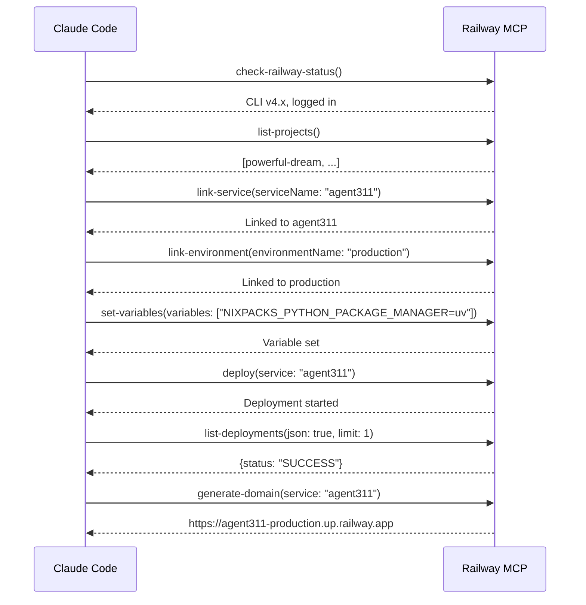
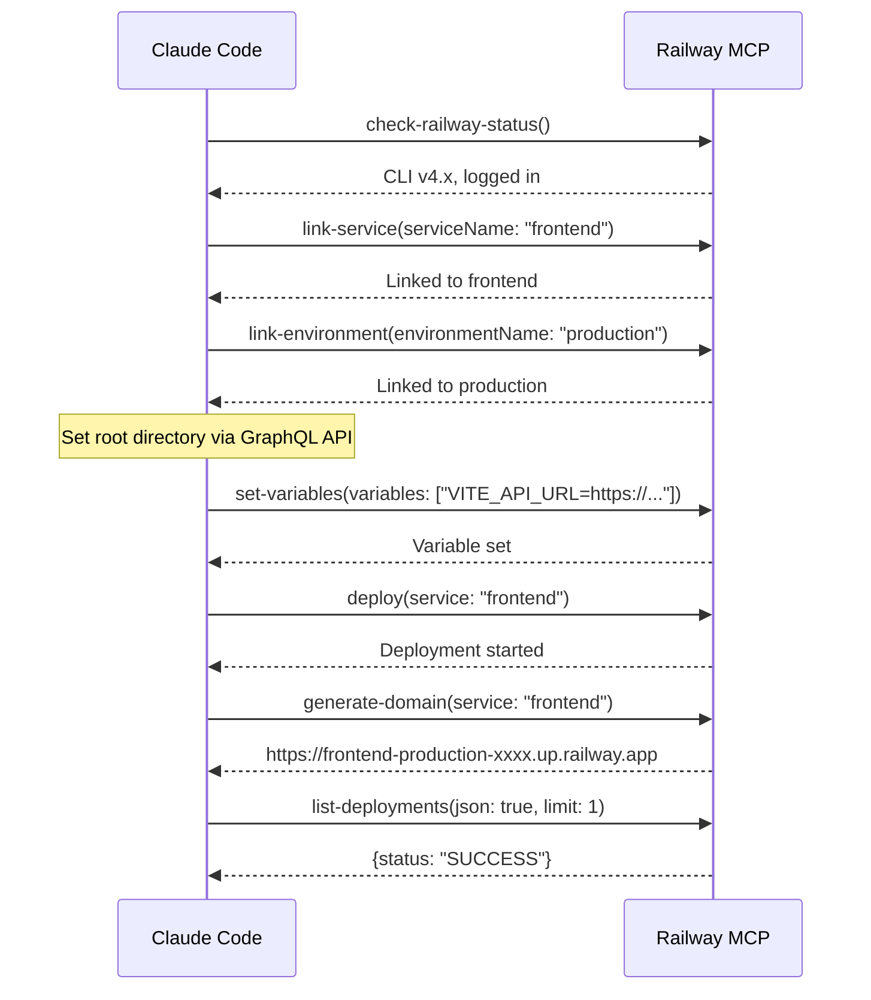
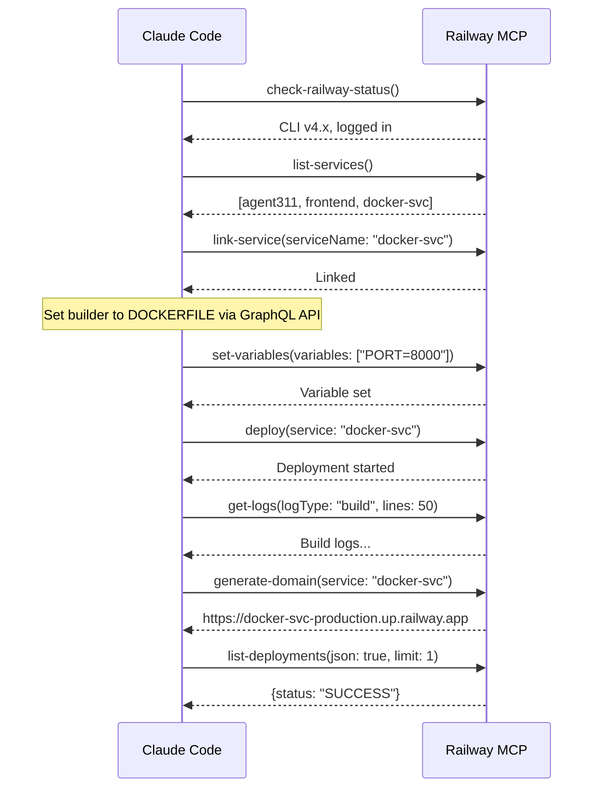
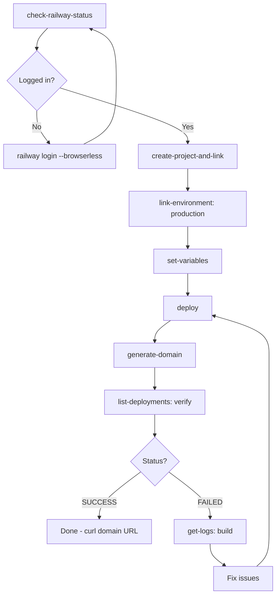
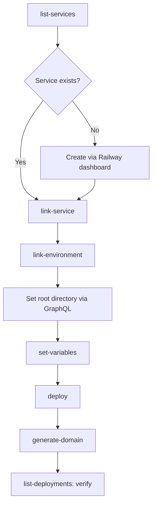
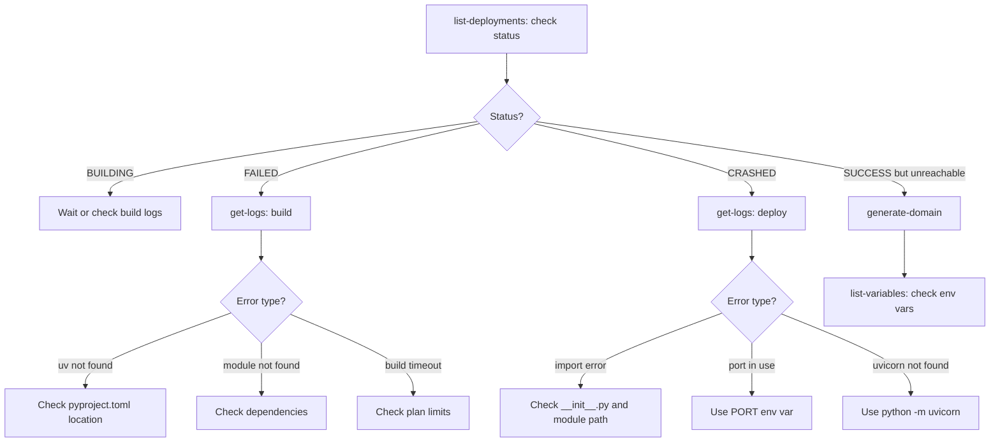

# Railway Deployment Guide (MCP-Driven)

A comprehensive guide to deploying services on Railway using MCP (Model Context Protocol) tools from Claude Code or the Railway CLI. Covers Python/FastAPI, React/JavaScript, and Docker deployments.

**Requirements:**
- **Railway CLI**: Install via `brew install railway` or `npm install -g @railway/cli`
- **Authentication**: Run `railway login` or set `RAILWAY_TOKEN` environment variable
  - Get your token: `railway login --browserless` (opens browser, copy token from URL)
  - Or from dashboard: [railway.app/account/tokens](https://railway.app/account/tokens)

---

## Table of Contents

- [Overview](#overview)
- [Architecture](#architecture)
- [Prerequisites](#prerequisites)
- [Railway MCP Setup](#railway-mcp-setup)
- [MCP Tool Quick Reference](#mcp-tool-quick-reference)
- [Railway CLI Reference](#railway-cli-reference)
- [Section A: Python/FastAPI (Nixpacks)](#section-a-pythonfastapi-nixpacks)
- [Section B: React/Vite Frontend (Nixpacks)](#section-b-reactvite-frontend-nixpacks)
- [Section B2: Next.js assistant-ui Frontend (Nixpacks)](#section-b2-nextjs-assistant-ui-frontend-nixpacks)
- [Section C: Docker Image Service](#section-c-docker-image-service)
- [Multi-Service Architecture](#multi-service-architecture)
- [MCP Workflow Diagrams](#mcp-workflow-diagrams)
- [Common Errors and Fixes](#common-errors-and-fixes)
- [Appendix: Railway GraphQL API Recipes](#appendix-railway-graphql-api-recipes)
- [Appendix: Creating a Claude Code Skill](#appendix-creating-a-claude-code-skill)

---

## Overview

This guide covers three deployment types, all driven by Railway MCP tools:

| Type | Builder | Use Case |
|------|---------|----------|
| **A. Python/FastAPI** | Nixpacks | Backend APIs with uv package manager |
| **B. React/Vite** | Nixpacks | Vite-based frontends served as static files |
| **B2. Next.js (assistant-ui)** | Nixpacks | Next.js apps in a monorepo subdirectory |
| **C. Docker** | Dockerfile | Custom builds, system dependencies, multi-stage |

Each section includes config files, MCP tool calls, mermaid diagrams, and battle-tested gotchas from real deployments.

### What are Railway MCP Tools?

Railway provides an MCP server that exposes 14 tools for managing projects, services, deployments, domains, environment variables, and logs — all callable from Claude Code without leaving the terminal.

---

## Architecture

```mermaid
graph TB
    subgraph Railway Project
        BE[Backend Service<br>Python/FastAPI<br>Nixpacks]
        FE[Frontend Service<br>React/Vite<br>Nixpacks]
        AUI[assistant-ui Service<br>Next.js<br>Nixpacks]
        DK[Docker Service<br>Custom Image<br>Dockerfile]
    end

    subgraph Domains
        BED[agent311-production.up.railway.app]
        FED[frontend-production.up.railway.app]
        AUID[assistantui-production.up.railway.app]
        DKD[docker-svc-production.up.railway.app]
    end

    BE --> BED
    FE --> FED
    AUI --> AUID
    DK --> DKD

    FE -->|fetch /api/chat| BE
    AUI -->|fetch /api/chat| BE
    DK -->|railway.internal| BE

    GH[GitHub Repo] -->|auto-deploy on push| Railway Project
    MCP[Claude Code + MCP] -->|Railway MCP Tools| Railway Project
```

### Project Structure (Monorepo)

```
repo-root/
├── agent311/                  # Python backend package
│   ├── __init__.py
│   └── main.py               # FastAPI app entry point
├── frontend/                  # React/Vite frontend (old)
│   ├── src/
│   │   ├── App.jsx
│   │   ├── App.css
│   │   └── main.jsx
│   ├── index.html
│   ├── package.json
│   ├── vite.config.js
│   ├── nixpacks.toml          # Frontend Nixpacks config
│   └── .env.production        # Build-time env vars
├── assistantui/               # Next.js assistant-ui frontend
│   ├── app/
│   │   ├── assistant.tsx      # Runtime config (API URL)
│   │   ├── layout.tsx
│   │   └── page.tsx
│   ├── components/
│   ├── package.json           # Must have engines.node >= 20
│   ├── nixpacks.toml          # assistantui Nixpacks config
│   └── railway.json           # Config-as-code for this service
├── pyproject.toml             # Must be at repo root
├── uv.lock                    # Must be at repo root
├── nixpacks.toml              # Backend Nixpacks config
├── railway.json               # Railway builder config
├── .python-version            # Python version pin (3.12)
├── start.sh                   # Local dev startup
└── CLAUDE.md
```

---

## Prerequisites

| Requirement | How to Get It | Verify |
|-------------|--------------|--------|
| Railway account | [railway.com](https://railway.com) | — |
| Railway CLI | `npm install -g @railway/cli` | `railway --version` |
| Railway auth | `railway login --browserless` | `railway whoami` |
| Railway MCP server | Configure in `.claude/settings.local.json` | `mcp__Railway__check-railway-status` |
| uv (Python) | `curl -LsSf https://astral.sh/uv/install.sh \| sh` | `uv --version` |
| Node.js (Frontend) | [nodejs.org](https://nodejs.org) | `node --version` |

---

## Railway MCP Setup

### 1. Install Railway CLI

```bash
npm install -g @railway/cli
```

### 2. Authenticate

```bash
railway login --browserless
```

This gives you a URL to open in your browser. After authenticating, paste the token back into the terminal.

For CI/CD or headless environments, set the `RAILWAY_TOKEN` environment variable:

```bash
export RAILWAY_TOKEN=your-token-here
```

### 3. Configure MCP Server

Add the Railway MCP server to your Claude Code settings. In `.claude/settings.local.json`:

```json
{
  "mcpServers": {
    "Railway": {
      "command": "railway",
      "args": ["mcp"]
    }
  }
}
```

### 4. Verify

Run the status check MCP tool from Claude Code:

```
mcp__Railway__check-railway-status()
```

This confirms: CLI installed, user authenticated, and linked project/environment (if any).

---

## MCP Tool Quick Reference

All 14 Railway MCP tools at a glance. For full parameter details, see [MCP Tool Reference](../.claude/skills/railway-deploy/references/mcp-tool-reference.md).

| Tool | Purpose | Key Params |
|------|---------|-----------|
| `check-railway-status` | Verify CLI + login | — |
| `create-project-and-link` | Create new project | `projectName`, `workspacePath` |
| `create-environment` | Create new environment | `environmentName`, `workspacePath` |
| `deploy` | Push code to Railway | `workspacePath`, `service` |
| `deploy-template` | Deploy a template | `searchQuery`, `workspacePath` |
| `generate-domain` | Create public URL | `workspacePath`, `service` |
| `get-logs` | View build/deploy logs | `workspacePath`, `logType` |
| `link-environment` | Switch environment | `environmentName`, `workspacePath` |
| `link-service` | Switch linked service | `workspacePath`, `serviceName` |
| `list-deployments` | Show deployment history | `workspacePath` |
| `list-projects` | Show all projects | — |
| `list-services` | Show project services | `workspacePath` |
| `list-variables` | Show env vars | `workspacePath` |
| `set-variables` | Set env vars | `workspacePath`, `variables` |

---

## Railway CLI Reference

While the MCP tools provide a seamless experience within Claude Code, you can also use the Railway CLI directly for all operations. This section shows CLI equivalents for every MCP tool.

### Installation

**Using Homebrew (macOS/Linux):**
```bash
brew install railway
```

**Using npm:**
```bash
npm install -g @railway/cli
```

**Verify installation:**
```bash
railway --version
```

### Authentication

```bash
# Interactive login (opens browser)
railway login

# Browserless login (for servers/CI)
railway login --browserless

# Check authentication status
railway whoami

# Use token directly
export RAILWAY_TOKEN=your-token-here
```

### Railway CLI Command Reference

Complete mapping of MCP tools to CLI commands:

| MCP Tool | Railway CLI Equivalent | Description |
|----------|----------------------|-------------|
| `check-railway-status` | `railway whoami` | Check CLI installation and authentication |
| `create-project-and-link` | `railway init`<br>`railway link` | Create new project and link to directory |
| `create-environment` | `railway environment` | Create/manage environments |
| `deploy` | `railway up` | Deploy current directory to Railway |
| `deploy-template` | `railway init --template <name>` | Deploy from template |
| `generate-domain` | `railway domain` | Generate/manage public domain |
| `get-logs` | `railway logs`<br>`railway logs --deployment <id>` | View service logs |
| `link-environment` | `railway environment <name>` | Switch active environment |
| `link-service` | `railway service <name>` | Link to specific service |
| `list-deployments` | `railway status` | Show deployment status |
| `list-projects` | `railway list` | List all projects |
| `list-services` | `railway status` | Show services in project |
| `list-variables` | `railway variables` | List environment variables |
| `set-variables` | `railway variables set KEY=value` | Set environment variables |

### Common CLI Workflows

**Initial setup:**
```bash
# Create and link new project
railway init
# Select "Create new project" → enter name → choose environment

# Or link to existing project
railway link
# Select project from list
```

**Deploy workflow:**
```bash
# Deploy current directory
railway up

# Deploy with CI mode (stream logs and exit)
railway up --ci

# Deploy specific service
railway up --service backend
```

**Environment management:**
```bash
# List environments
railway environment

# Switch environment
railway environment production

# Create new environment
railway environment add staging
```

**Service management:**
```bash
# List services
railway status

# Link to specific service
railway service backend

# View service logs
railway logs

# View logs with filters (CLI v4.9.0+)
railway logs --lines 100
railway logs --filter "error"

# Stream live logs
railway logs --follow
```

**Domain management:**
```bash
# Generate domain for current service
railway domain

# List all domains
railway domain --list
```

**Variable management:**
```bash
# List variables
railway variables

# Set variable
railway variables set API_KEY=abc123

# Set multiple variables
railway variables set API_KEY=abc123 DEBUG=true

# Delete variable
railway variables delete API_KEY
```

**Project info:**
```bash
# Show project status
railway status

# Show deployment history
railway status --json | jq

# Open project in browser
railway open
```

### CLI vs MCP: When to Use Which

**Use Railway CLI when:**
- Working outside Claude Code
- Writing shell scripts or CI/CD pipelines
- Need fine-grained control over flags
- Troubleshooting authentication issues
- Want to use `railway open` to jump to dashboard

**Use Railway MCP tools when:**
- Working within Claude Code
- Want Claude to manage deployments automatically
- Prefer declarative tool calls over shell commands
- Building Claude Code skills that automate Railway tasks

### Advanced CLI Usage

**Link project to specific directory:**
```bash
cd /path/to/project
railway link
# Or specify path:
railway link --workdir /path/to/project
```

**Deploy from subdirectory:**
```bash
# Deploy frontend subfolder
cd frontend
railway up

# Or from root with service flag
railway up --service frontend
```

**View build logs:**
```bash
railway logs --deployment <deployment-id>
```

**Run commands in Railway environment:**
```bash
# Run command with Railway env vars loaded
railway run npm start
railway run python manage.py migrate
```

**Shell into running service:**
```bash
railway shell
```

---

## Section A: Python/FastAPI (Nixpacks)

Deploy a FastAPI backend using uv as the package manager and Nixpacks as the builder.

### Prerequisites

- `uv` installed locally (`uv --version`)
- `pyproject.toml` + `uv.lock` at repo root
- `.python-version` at repo root

### Config Files

#### `pyproject.toml` (repo root)

```toml
[project]
name = "agent311"
version = "0.1.0"
description = ""
readme = "README.md"
requires-python = ">=3.11"
dependencies = [
    "claude-code-sdk",
    "fastapi",
    "uvicorn",
]

[build-system]
requires = ["hatchling"]
build-backend = "hatchling.build"
```

> **Gotcha:** The build backend is `hatchling.build`, NOT `hatchling.backends` (which doesn't exist and will crash the build).

#### `nixpacks.toml` (repo root)

```toml
[variables]
NIXPACKS_UV_VERSION = "0.10.0"

[start]
cmd = "python -m uvicorn agent311.main:app --host 0.0.0.0 --port ${PORT:-8000}"
```

> **Gotcha:** `NIXPACKS_UV_VERSION` MUST be set to a recent version. Nixpacks defaults to `0.4.30`, which is ancient and will fail to install.

> **Gotcha:** Use `python -m uvicorn`, not bare `uvicorn`. The Nixpacks venv `bin/` may not be on PATH at runtime.

> **Gotcha:** Do NOT add custom `[phases.install]` commands. This overrides Nixpacks' automatic uv installation and causes `uv: command not found`.

#### `railway.json` (repo root)

```json
{
  "$schema": "https://railway.com/railway.schema.json",
  "build": {
    "builder": "NIXPACKS"
  }
}
```

#### `.python-version` (repo root)

```
3.12
```

#### `uv.lock`

Generate with:
```bash
uv lock
```

Commit this file. Nixpacks detects uv by the presence of `uv.lock` at repo root.

### Required Environment Variable

```
NIXPACKS_PYTHON_PACKAGE_MANAGER=uv
```

This explicitly tells Nixpacks to use uv instead of pip. Set it via MCP (see below) or the Railway dashboard.

### MCP Deployment Flow



### Step-by-Step MCP Calls

**1. Verify status:**
```
mcp__Railway__check-railway-status()
```

**2. Link to project and service:**
```
mcp__Railway__link-service(
  workspacePath: "/path/to/repo",
  serviceName: "agent311"
)
mcp__Railway__link-environment(
  workspacePath: "/path/to/repo",
  environmentName: "production"
)
```

**3. Set environment variables:**
```
mcp__Railway__set-variables(
  workspacePath: "/path/to/repo",
  variables: ["NIXPACKS_PYTHON_PACKAGE_MANAGER=uv"],
  service: "agent311"
)
```

**4. Deploy:**
```
mcp__Railway__deploy(
  workspacePath: "/path/to/repo",
  service: "agent311"
)
```

**5. Generate public domain:**
```
mcp__Railway__generate-domain(
  workspacePath: "/path/to/repo",
  service: "agent311"
)
```

**6. Verify deployment:**
```
mcp__Railway__list-deployments(
  workspacePath: "/path/to/repo",
  service: "agent311",
  json: true,
  limit: 3
)
```

**7. Check logs if needed:**
```
mcp__Railway__get-logs(
  workspacePath: "/path/to/repo",
  logType: "build",
  service: "agent311",
  lines: 50
)
```

### Verification

```bash
curl https://agent311-production.up.railway.app/
# {"message":"Hello, World!"}
```

Visit `https://agent311-production.up.railway.app/docs` for the auto-generated FastAPI Swagger UI.

### What Nixpacks Does Automatically

1. Detects `pyproject.toml` + `uv.lock` at repo root
2. Sets up Python 3.12 via Nix
3. Creates a venv and installs uv via pip (`pip install uv==$NIXPACKS_UV_VERSION`)
4. Runs `uv sync --no-dev --frozen` to install all dependencies
5. Starts the app with the command from `nixpacks.toml`

---

## Section B: React/Vite Frontend (Nixpacks)

Deploy a Vite React frontend as a separate Railway service that communicates with the FastAPI backend.

### Prerequisites

- Node.js installed locally
- `package.json` in the frontend directory
- Backend already deployed with a public domain

### Config Files

#### `frontend/package.json`

```json
{
  "name": "agent311-frontend",
  "private": true,
  "version": "0.1.0",
  "type": "module",
  "scripts": {
    "dev": "vite",
    "build": "vite build",
    "preview": "vite preview"
  },
  "dependencies": {
    "@ai-sdk/react": "^3.0.79",
    "react": "^19.0.0",
    "react-dom": "^19.0.0"
  },
  "devDependencies": {
    "@vitejs/plugin-react": "^4.3.4",
    "vite": "^6.0.0"
  }
}
```

#### `frontend/vite.config.js`

```js
import { defineConfig } from "vite";
import react from "@vitejs/plugin-react";

export default defineConfig({
  plugins: [react()],
});
```

#### `frontend/nixpacks.toml`

```toml
[variables]
VITE_API_URL = "https://agent311-production.up.railway.app"

[build]
cmd = "npm install && npm run build"

[start]
cmd = "npx serve dist"
```

#### `frontend/.env.production`

```
VITE_API_URL=https://agent311-production.up.railway.app
```

> **Gotcha:** Vite embeds `VITE_*` variables into the JavaScript bundle at **build time**, not runtime. Railway environment variables and Nixpacks `[variables]` are only available at container runtime. You MUST use `.env.production` for Vite build-time variables.

### CORS on the Backend

The FastAPI backend must allow cross-origin requests since frontend and backend are on different domains:

```python
from fastapi import FastAPI
from fastapi.middleware.cors import CORSMiddleware

app = FastAPI()

app.add_middleware(
    CORSMiddleware,
    allow_origins=["*"],
    allow_methods=["*"],
    allow_headers=["*"],
)
```

### Root Directory

The frontend lives in `frontend/`, not the repo root. You must set the root directory via the Railway GraphQL API (see [Appendix](#appendix-railway-graphql-api-recipes)):

```bash
curl -s -X POST https://backboard.railway.com/graphql/v2 \
  -H "Authorization: Bearer $RAILWAY_TOKEN" \
  -H "Content-Type: application/json" \
  -d '{
    "query": "mutation { serviceInstanceUpdate(serviceId: \"<SERVICE_ID>\", environmentId: \"<ENV_ID>\", input: { rootDirectory: \"frontend\" }) }"
  }'
```

### MCP Deployment Flow



### Step-by-Step MCP Calls

**1. Link to frontend service:**
```
mcp__Railway__link-service(
  workspacePath: "/path/to/repo",
  serviceName: "frontend"
)
```

**2. Set environment variables:**
```
mcp__Railway__set-variables(
  workspacePath: "/path/to/repo",
  variables: ["VITE_API_URL=https://agent311-production.up.railway.app"],
  service: "frontend"
)
```

**3. Set root directory via GraphQL** (see [Appendix](#set-root-directory))

**4. Deploy:**
```
mcp__Railway__deploy(
  workspacePath: "/path/to/repo",
  service: "frontend"
)
```

**5. Generate domain:**
```
mcp__Railway__generate-domain(
  workspacePath: "/path/to/repo",
  service: "frontend"
)
```

**6. Verify:**
```
mcp__Railway__list-deployments(
  workspacePath: "/path/to/repo",
  service: "frontend",
  json: true,
  limit: 3
)
```

### Verification

```bash
curl https://frontend-production-xxxx.up.railway.app/
# Returns HTML of the React app
```

---

## Section B2: Next.js assistant-ui Frontend (Nixpacks)

Deploy a Next.js frontend (using [assistant-ui](https://github.com/assistant-ui/assistant-ui)) as a third Railway service in a monorepo. This section documents the real pitfalls encountered deploying `assistantui/` alongside the existing backend and Vite frontend.

For the full step-by-step walkthrough and all gotchas, see the dedicated guide: **[Deploying assistant-ui on Railway](railway-nextjs-assistantui.md)**.

### Key Differences from Vite Frontend

| Aspect | Vite Frontend (Section B) | Next.js assistant-ui |
|--------|--------------------------|---------------------|
| Framework | Vite + React | Next.js 16 |
| Directory | `frontend/` | `assistantui/` |
| Node.js version | 18+ works | **20+ required** |
| Serving | `npx serve dist` (static) | `next start` (SSR) |
| API URL | Build-time `VITE_*` env var | Runtime `NEXT_PUBLIC_*` env var |
| Config-as-code | Not used | `assistantui/railway.json` |

### Critical Gotchas (Summary)

1. **Root directory** must be set in Railway dashboard (Settings > Root Directory > `/assistantui`) — cannot be set via MCP tools
2. **Config-as-code path** must be set in Railway dashboard (Settings > Config-as-code > `assistantui/railway.json`) — then Apply changes
3. **Dashboard changes require Apply** — Railway shows "N changes" badge but doesn't auto-apply
4. **`packageManager` field in package.json** will override your nixpacks.toml install commands — remove it if using npm
5. **Node.js 18 is the Nixpacks default** but Next.js 16 requires Node.js 20+ — add `"engines": {"node": ">=20.9.0"}` to package.json
6. **Force `providers = ["node"]`** in nixpacks.toml or the root `pyproject.toml` causes Python provider detection
7. **Backend must handle AI SDK v6 message format** — assistant-ui sends `parts` array, not `content` string

---

## Section C: Docker Image Service

Deploy a service using a custom Dockerfile instead of Nixpacks.

### When to Use Docker vs Nixpacks

| Criteria | Nixpacks | Docker |
|----------|----------|--------|
| Standard Python/Node.js app | Yes | Overkill |
| Custom system packages | Limited | Yes |
| Multi-stage builds | No | Yes |
| Precise build control | No | Yes |
| Existing Dockerfile | N/A | Yes |
| Zero-config deployment | Yes | No |

### Dockerfile Examples

#### Python/FastAPI

```dockerfile
FROM python:3.12-slim

WORKDIR /app

# Install uv
RUN pip install uv

# Install dependencies
COPY pyproject.toml uv.lock ./
RUN uv sync --no-dev --frozen

# Copy application
COPY agent311/ ./agent311/

EXPOSE 8000
CMD ["python", "-m", "uvicorn", "agent311.main:app", "--host", "0.0.0.0", "--port", "8000"]
```

#### Node.js/React (Multi-Stage)

```dockerfile
# Build stage
FROM node:20-slim AS builder
WORKDIR /app
COPY package*.json ./
RUN npm ci
COPY . .
RUN npm run build

# Production stage
FROM node:20-slim
WORKDIR /app
RUN npm install -g serve
COPY --from=builder /app/dist ./dist
EXPOSE 3000
CMD ["serve", "dist", "-l", "3000"]
```

### Config: `railway.json`

```json
{
  "$schema": "https://railway.com/railway.schema.json",
  "build": {
    "builder": "DOCKERFILE"
  }
}
```

You can also set the builder via GraphQL API (see [Appendix](#set-builder)).

### MCP Deployment Flow



### Step-by-Step MCP Calls

**1. Link to service:**
```
mcp__Railway__link-service(
  workspacePath: "/path/to/repo",
  serviceName: "docker-svc"
)
```

**2. Set builder via GraphQL** (see [Appendix](#set-builder))

**3. Set variables:**
```
mcp__Railway__set-variables(
  workspacePath: "/path/to/repo",
  variables: ["PORT=8000"],
  service: "docker-svc"
)
```

**4. Deploy:**
```
mcp__Railway__deploy(
  workspacePath: "/path/to/repo",
  service: "docker-svc"
)
```

**5. Generate domain:**
```
mcp__Railway__generate-domain(
  workspacePath: "/path/to/repo",
  service: "docker-svc"
)
```

**6. Verify:**
```bash
curl https://docker-svc-production.up.railway.app/
```

### .dockerignore

Always include a `.dockerignore` to keep the build context small:

```
.git
node_modules
__pycache__
*.pyc
.env
.venv
dist
```

---

## Multi-Service Architecture

### Monorepo Layout

```
repo-root/
├── agent311/         ← Backend service (root dir: /)
│   ├── __init__.py
│   └── main.py
├── frontend/         ← Vite frontend service (root dir: /frontend)
│   ├── src/
│   ├── package.json
│   └── nixpacks.toml
├── assistantui/      ← Next.js frontend service (root dir: /assistantui)
│   ├── app/
│   ├── package.json
│   ├── nixpacks.toml
│   └── railway.json  ← Config-as-code for this service
├── pyproject.toml    ← Backend config (at repo root)
├── nixpacks.toml     ← Backend Nixpacks config
└── railway.json      ← Backend Railway config
```

Each Railway service in the same project can have a different **root directory**:
- Backend: `/` (repo root) — reads `pyproject.toml`, `nixpacks.toml`, `railway.json`
- Frontend: `/frontend` — reads `frontend/package.json`, `frontend/nixpacks.toml`
- assistant-ui: `/assistantui` — reads `assistantui/package.json`, `assistantui/nixpacks.toml`, `assistantui/railway.json`

### Service Linking and Root Directories

When you have multiple services, you need to:
1. Link to the correct service before deploying
2. Set the correct root directory for each service

```
# Deploy backend
mcp__Railway__link-service(workspacePath: "...", serviceName: "agent311")
mcp__Railway__deploy(workspacePath: "...", service: "agent311")

# Deploy frontend
mcp__Railway__link-service(workspacePath: "...", serviceName: "frontend")
mcp__Railway__deploy(workspacePath: "...", service: "frontend")
```

### Internal Networking

Services within the same Railway project can communicate via internal networking using `<service-name>.railway.internal`:

```
# From frontend service, reach backend internally:
http://agent311.railway.internal:8000/api/chat
```

This is faster and free (no egress charges) compared to using public domains.

---

## MCP Workflow Diagrams

### New Project Setup



### Add Service to Existing Project



### Debug Failed Deployment



---

## Common Errors and Fixes

### Python/FastAPI

| Error | Cause | Fix |
|-------|-------|-----|
| `uv: command not found` | `pyproject.toml`/`uv.lock` not at repo root, or custom install phase | Move files to root, remove `[phases.install]` |
| `pip install uv==0.4.30` fails | Default uv version too old | Set `NIXPACKS_UV_VERSION = "0.10.0"` |
| `No module named 'hatchling.backends'` | Wrong `build-backend` value | Use `build-backend = "hatchling.build"` |
| `uvicorn: command not found` | venv bin not on PATH | Use `python -m uvicorn` |
| App not reachable | No public domain | Run `generate-domain` |

### React/Vite

| Error | Cause | Fix |
|-------|-------|-----|
| "Failed to connect to backend" | `VITE_API_URL` not set at build time | Add `.env.production` with backend URL |
| CORS error in browser | Backend missing CORS middleware | Add `CORSMiddleware` to FastAPI |
| Frontend serves Python app | Root directory not set | Set `rootDirectory: "frontend"` via GraphQL |
| `npx serve` not found | Node.js not detected | Ensure `package.json` in service root dir |

### Next.js / assistant-ui

| Error | Cause | Fix |
|-------|-------|-----|
| `Node.js version ">=20.9.0" is required` | Nixpacks defaults to Node.js 18 | Add `"engines": {"node": ">=20.9.0"}` to `package.json` |
| `pnpm i --frozen-lockfile` fails, no lockfile | `packageManager` field in `package.json` forces pnpm | Remove `"packageManager": "pnpm@..."` from `package.json` |
| Python provider detected instead of Node | Root `pyproject.toml` confuses Nixpacks | Add `providers = ["node"]` to `nixpacks.toml` |
| Config-as-code not picked up | Path not set or changes not applied | Set Config-as-code to `assistantui/railway.json` in dashboard, then Apply |
| Agent loses conversation memory | Backend reads `content` but AI SDK v6 sends `parts` | Handle both `msg.content` and `msg.parts` in backend |
| Root directory ignored | Dashboard changes pending | Click Apply after changing settings (check "N changes" badge) |

### Docker

| Error | Cause | Fix |
|-------|-------|-----|
| `Dockerfile not found` | Wrong location or root dir | Move to root or set root directory |
| Build context too large | No `.dockerignore` | Add `.dockerignore` |
| Port mismatch | `EXPOSE` doesn't match app port | Align `EXPOSE`, app port, and `PORT` env var |
| Builder not set | Railway defaults to Nixpacks | Set `"builder": "DOCKERFILE"` in `railway.json` |

### MCP Tools

| Error | Cause | Fix |
|-------|-------|-----|
| MCP server not responding | Not configured | Add Railway MCP to `.claude/settings.local.json` |
| "Not logged in" | CLI not authenticated | `railway login --browserless` |
| "No linked project" | Workspace not linked | `create-project-and-link` or `link-service` |
| Vars set but old code running | Deploy not triggered | Run `deploy` or push to GitHub |

For the full troubleshooting reference, see [Troubleshooting Guide](../.claude/skills/railway-deploy/references/troubleshooting.md).

---

## Appendix: Railway GraphQL API Recipes

Some Railway operations (root directory, builder type) aren't exposed via MCP tools and require the GraphQL API.

### Prerequisites

Get your `RAILWAY_TOKEN`:
```bash
# Already set if you used railway login
echo $RAILWAY_TOKEN
```

Get service and environment IDs:
```bash
railway status --json
```

### Set Root Directory

<a id="set-root-directory"></a>

```bash
curl -s -X POST https://backboard.railway.com/graphql/v2 \
  -H "Authorization: Bearer $RAILWAY_TOKEN" \
  -H "Content-Type: application/json" \
  -d '{
    "query": "mutation { serviceInstanceUpdate(serviceId: \"<SERVICE_ID>\", environmentId: \"<ENV_ID>\", input: { rootDirectory: \"frontend\" }) }"
  }'
```

### Set Builder

<a id="set-builder"></a>

```bash
curl -s -X POST https://backboard.railway.com/graphql/v2 \
  -H "Authorization: Bearer $RAILWAY_TOKEN" \
  -H "Content-Type: application/json" \
  -d '{
    "query": "mutation { serviceInstanceUpdate(serviceId: \"<SERVICE_ID>\", environmentId: \"<ENV_ID>\", input: { builder: DOCKERFILE }) }"
  }'
```

Valid builder values: `NIXPACKS`, `DOCKERFILE`

### Create Domain via GraphQL

```bash
curl -s -X POST https://backboard.railway.com/graphql/v2 \
  -H "Authorization: Bearer $RAILWAY_TOKEN" \
  -H "Content-Type: application/json" \
  -d '{
    "query": "mutation { serviceDomainCreate(input: { serviceId: \"<SERVICE_ID>\", environmentId: \"<ENV_ID>\" }) { domain } }"
  }'
```

---

## Appendix: Creating a Claude Code Skill

<a id="appendix-creating-a-claude-code-skill"></a>

This project includes a Claude Code skill that automates Railway deployments. Here's how skills work and how to create your own.

### What Are Skills?

Skills are markdown files with YAML frontmatter that teach Claude Code how to handle specific tasks. When a user's request matches the skill's `description`, Claude Code loads the skill and follows its instructions.

### Skill File Structure

```
.claude/skills/<skill-name>/
├── SKILL.md                      # Main skill file (YAML frontmatter + instructions)
└── references/                   # Supporting reference docs
    ├── mcp-tool-reference.md
    └── troubleshooting.md
```

### SKILL.md Format

```yaml
---
name: skill-name
description: >
  Trigger phrases that activate this skill.
  Example: "deploy to railway", "check railway status", etc.
version: 1.0.0
---

# Skill Title

Instructions for Claude Code to follow when this skill is activated.
Include step-by-step procedures, decision trees, and reference links.
```

### Frontmatter Fields

| Field | Required | Description |
|-------|----------|-------------|
| `name` | Yes | Unique skill identifier (kebab-case) |
| `description` | Yes | Trigger phrases — Claude Code matches user requests against this |
| `version` | No | Semantic version for tracking changes |

### The Railway Deploy Skill

This project's skill lives at `.claude/skills/railway-deploy/SKILL.md`. It:

1. **Detects deployment type** (Python, React, Docker) from the user's request
2. **Runs pre-flight checks** (CLI status, project/service linking)
3. **Verifies config files** exist with correct content
4. **Executes MCP tool calls** in the correct order
5. **Provides gotcha checklists** to catch common mistakes
6. **Debugs failures** using build/deploy logs

### Example Interaction

User: "Deploy the backend to Railway"

The skill activates and Claude Code:
1. Checks Railway CLI status
2. Links to the correct project/service/environment
3. Verifies `pyproject.toml`, `uv.lock`, `nixpacks.toml`, `railway.json` exist
4. Sets `NIXPACKS_PYTHON_PACKAGE_MANAGER=uv`
5. Deploys via `mcp__Railway__deploy`
6. Generates a domain
7. Verifies the deployment succeeded

---

## Local Development

### Backend

```bash
# From repo root
uv run uvicorn agent311.main:app --host 0.0.0.0 --port 8000 --reload
```

### Frontend

```bash
cd frontend
npm install
npm run dev
```

The Vite dev server proxies to `http://localhost:8000` by default (via the fallback in `App.jsx`).

### assistant-ui Frontend

```bash
cd assistantui
npm install
npm run dev
```

The Next.js dev server runs on `http://localhost:3000` and connects to the backend at `NEXT_PUBLIC_API_URL` (default: `http://localhost:8000`).

### All Three Together

Run backend and both frontends in separate terminals:

```bash
# Terminal 1 - Backend
uv run uvicorn agent311.main:app --host 0.0.0.0 --port 8000 --reload

# Terminal 2 - Vite Frontend (port 5173)
cd frontend && npm run dev

# Terminal 3 - assistant-ui Frontend (port 3000)
cd assistantui && npm run dev
```

---

## See Also

- [FastAPI Setup Guide](railway-fastapi-setup.md) — Original detailed FastAPI deployment walkthrough
- [React Frontend Guide](railway-react-frontend.md) — Original detailed React/Vite frontend deployment walkthrough
- [Next.js assistant-ui Guide](railway-nextjs-assistantui.md) — Deploying assistant-ui in a monorepo subdirectory (all pitfalls documented)
- [MCP Tool Reference](../.claude/skills/railway-deploy/references/mcp-tool-reference.md) — Full parameter docs for all 14 tools
- [Troubleshooting](../.claude/skills/railway-deploy/references/troubleshooting.md) — Consolidated error table
- [Railway Deploy Skill](../.claude/skills/railway-deploy/SKILL.md) — Claude Code automation skill
