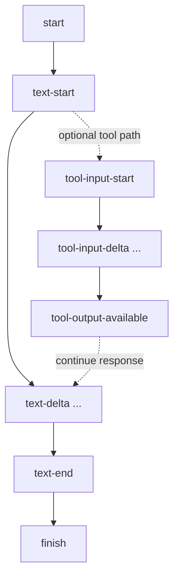
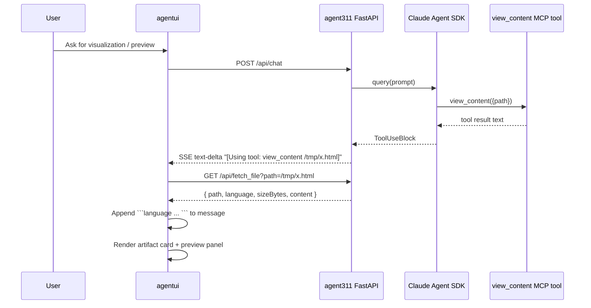

# View Content Artifact Viewer (Junior Dev Guide)

This document explains how `agent311` and `agentui` work together to preview local host files (like `.html` and `.jsx`) inside the artifact panel.

The core idea:

- Agent emits a tool call marker like:
  - `[Using tool: view_content /tmp/hello.html]`
- Frontend sees that marker, calls backend `/api/fetch_file`, and appends a code block.
- Existing artifact UI turns that code block into a clickable preview card.

## Why this exists

We want the AI agent to reference a file path on the host machine and let users preview that file in the app UI, without manually pasting file content into chat.

## End-to-End Flow

```mermaid
flowchart TD
    U[User prompt] --> B[Backend /api/chat]
    B --> A[Claude Agent SDK]
    A --> T[Custom MCP tool: view_content(path)]
    T --> B
    B --> S[SSE text-delta: [Using tool: view_content /tmp/file]]
    S --> F[agentui stream parser]
    F --> Q[GET /api/fetch_file?path=/tmp/file]
    Q --> R[JSON: path, language, content]
    R --> M[Append fenced code block to assistant message]
    M --> C[Code block parser -> Artifact Card]
    C --> P[Artifact Panel Preview]
```

## Basic Streaming Events (Important)

These are the event names you will commonly see in streaming chat integrations:

- `start`
- `tool-input-start`
- `tool-input-delta`
- `text-start`
- `text-delta`
- `text-end`
- `tool-output-available`
- `finish`

### Event Order Model



### What this repo emits today

- Emitted today:
  - `start`, `text-start`, `text-delta`, `text-end`, `finish`
  - terminal sentinel: `data: [DONE]`
- Not emitted as structured events yet:
  - `tool-input-start`, `tool-input-delta`, `tool-output-available`

Instead of structured tool events, current backend sends visible tool markers in `text-delta`, for example:

- `[Using tool: Read]`
- `[Using tool: view_content /tmp/hello.html]`

## Sequence Diagram



## What was implemented

## 1. Backend custom tool

File: `agent311/main.py`

- Added Agent SDK custom MCP tool:
  - `@tool("view_content", ..., {"path": str})`
- Registered with:
  - `create_sdk_mcp_server(name="agent311_host", tools=[view_content])`
- Enabled in `ClaudeAgentOptions`:
  - `mcp_servers={"agent311_host": agent311_host_tools}`
  - `allowed_tools` includes:
    - `mcp__agent311_host__view_content`

## 2. Backend SSE marker emission

When the backend receives `ToolUseBlock` for this MCP tool, it emits:

- `[Using tool: view_content <path>]\n`

This keeps behavior consistent with existing markers like `[Using tool: Read]`.

## 3. Backend file endpoint

File: `agent311/main.py`

Added:

- `GET /api/fetch_file?path=<absolute_path>`

Returns:

```json
{
  "path": "/private/tmp/hello.html",
  "language": "html",
  "sizeBytes": 1234,
  "content": "<!doctype html>..."
}
```

## 4. Frontend marker detection + fetch

File: `agentui/components/chat.tsx`

- Detects markers with regex for `view_content` paths.
- Calls backend `/api/fetch_file`.
- Appends returned content as fenced code block:
  - ```html ...```
  - ```jsx ...```
  - etc.

This intentionally reuses the existing artifact flow instead of introducing a new message type.

## 5. Frontend tool parsing with args

File: `agentui/components/chat-messages.tsx`

- Updated tool regex to support tool arguments (path after tool name).
- Example now handled:
  - `[Using tool: view_content /tmp/hello.jsx]`
- Marker remains visible in tool UI (not suppressed).

## 6. Lint fix required by this work

File: `agentui/components/ai-elements/code-block.tsx`

- Removed sync `setState` inside `useEffect` (React lint rule).
- Switched to microtask scheduling (`queueMicrotask`) with cancellation guard.

## Security and Validation Rules

Backend validates all file reads before returning content:

- Allowed extensions:
  - `.html`, `.htm`, `.js`, `.mjs`, `.cjs`, `.jsx`, `.tsx`
- Allowed roots:
  - `/tmp` only
- Max file size:
  - `200000` bytes

HTTP behavior:

- `404`: file not found
- `403`: path outside allowed root (for allowed extension)
- `400`: invalid path, unsupported extension, too large, etc.

## Important Contracts

If you change one side, update the other side too.

## Contract A: SSE marker format

Current expected format:

- `[Using tool: view_content /tmp/hello.html]`

Frontend parser depends on this pattern.

## Contract B: `/api/fetch_file` response

Frontend expects:

- `path` (string)
- `language` (string)
- `content` (string)
- `sizeBytes` (number)

## Test Notes (already verified locally)

- `/api/fetch_file` works for:
  - `/tmp/hello.html`
  - `/tmp/hello.js`
  - `/tmp/hello.jsx`
- `/api/fetch_file` blocks unsupported file types and out-of-root paths.
- `/api/chat` stream includes marker:
  - `[Using tool: view_content /tmp/hello.jsx]`
- Frontend build/lint pass with this implementation.

## Quick Troubleshooting

1. Marker appears but no artifact card:
   - Check browser network for `/api/fetch_file` request.
   - Confirm backend returned `200` and includes `content`.
2. Marker path exists but fetch returns 403:
   - Path is outside `/tmp` or resolves outside it.
3. Fetch returns 400:
   - Extension not in allowlist, empty path, or file too large.
4. Tool never gets called:
   - Confirm `allowed_tools` includes `mcp__agent311_host__view_content`.
   - Confirm prompt asks agent to use `view_content`.
